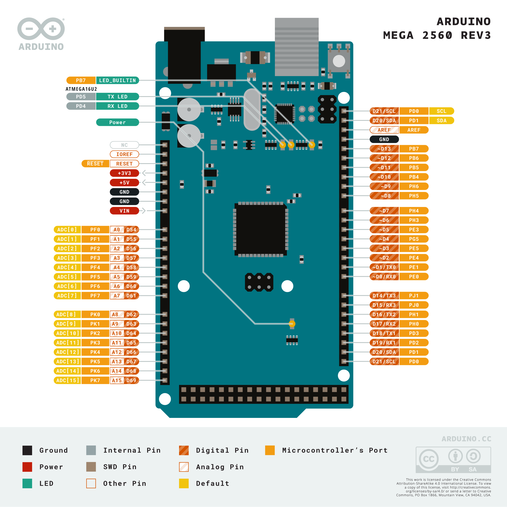
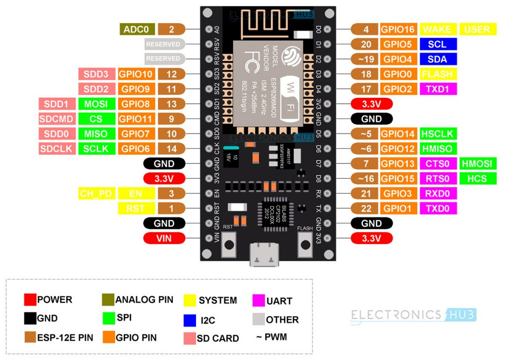
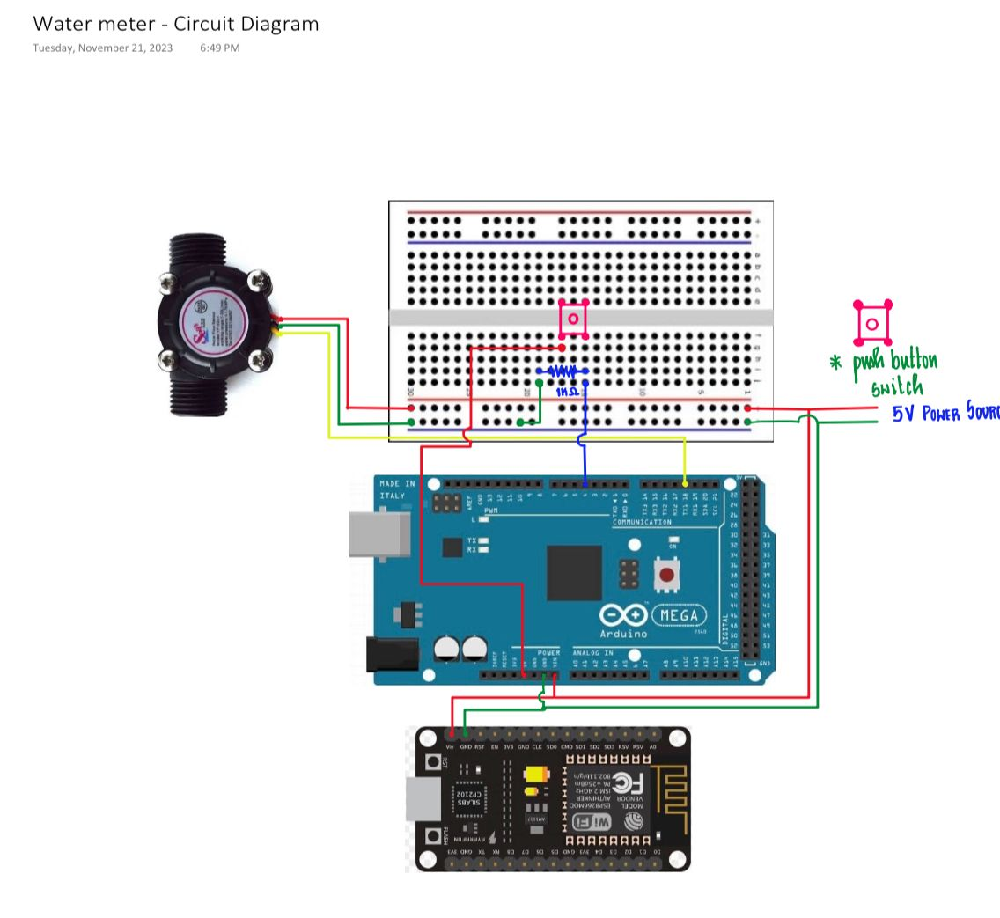

# Arduino and esp32 based IoT Water meter 

This project is a great build to get started on with your journey in the world of microcontrollers and Internet of Things. In this project you shall learn to use the water flow hall sensor and produce some useful information from the rawdata fed by the sensor to the arduino mega board. You will also learn to use the UART pins to communicate between the Arduino and esp32 boards, and send the live rawdata to a remote cloud database hosted on the internet by Blynk, an IoT platform which supports both android and ios. Have a great build!

## Hardware Required

| Item | Quantity |
|--------|--------|
| Arduino mega 2560 board | 1 |
| Esp32 Wi-Fi board | 1 |
| Resistor (1k Ω) | 1 |
| Momentary switch | 1 |
| YF-S201 Flow sensor | 1 |
| PVC tubing | Q.S |
| Jumper wires | Q.S |
| Breadboard 400 | 1 |
| Data cables | 2 |

## Arduino Board Pinouts

Here are some commonly used Arduino boards and their pinouts.

1. Arduino Uno R3

    

2. Arduino Mega 2560 R3

    

## Wi-Fi Development Board Pinouts

Here are some commonly used Wi-Fi development boards and their pinouts.

1. ESP32 Development Board

    

2. ESP8266 Development Board

    

## Software Required

### Downloads and Installations

1. [Arduino IDE](https://www.arduino.cc/en/software) - download all the necessary drivers prompted along the IDE installation.

2. Follow the steps below to install the drivers for Esp32 and Esp8266:

   
    ```
    https://dl.espressif.com/dl/package_esp32_index.json

    ```
    
    1. Copy the above path.
    2. Open your Arduino IDE.
    3. File > Preferences > Additional boards manager URLs.
    4. Paste the above path and click 'Ok'.
    5. Tools > Board > Boards Manager.
    6. Search for esp32 and install esp32 by Espressif Systems.
   

    ```
    http://arduino.esp8266.com/stable/package_esp8266com_index.json

    ```
    
    1. Copy the above path.
    2. Open your Arduino IDE.
    3. File > Preferences > Additional boards manager URLs.
    4. To add another URL code, seperate the existing URL with a comma.
    5. Tools > Board > Boards Manager.
    6. Search for esp8266 and install esp8266 by ESP8266 Community.

3. Follow the steps below to install the blynk library:

    1. Open your Arduino IDE.
    2. Tools > Manage libraries.
    3. Search for blynk and install blynk by Volodymyr Shymanskyy.

## Phase 1 - Circuit assembly.

Now that we have procured all the hardware required and installed the required software, drivers and libraries, let's get started with the circuit assembly!



> Double check the pin numbers that you connect!

## Phase 2 - Coding in Arduino IDE.

Have a fun code along session with the instructor (me, the proud author of this README file), feel free to check out the pre-existing code available in the github repository, shoot out any questions you may have to ask, even if the instructor doesn't know he would get back to you shortly.

## Phase 3 - Blynk Setup.

Follow these steps to create a Blynk web dashboard where you can see your data dynamics live:

1. Open your web browser and search for [Blynk](https://blynk.io/).
2. Register your account with Blynk to use their free cloud service.
3. Once logged in, go to Templates > create template.
4. Enter the title of your template and fill in the other relevant fields.
5. Add and configure datastreams for every variable which is to be monitored.
6. Create a new device using the template.
7. Create widgets and personalize your dashboard as you like.
8. Copy the blynk device credentials for integration with the esp device via the arduino source code.

## Phase 4 - Do-it-yourself:

Try out the following challenges on successful completion of the above phases.

1. Create a function "calculate_volume" given that the volume constant is 2.663 which when multiplied with the pulseCount gives the approximate volume of water flown through the water meter.

2. Create a function "calculate_flow_rate", hint: flow rate is basically the volume of water flowing through the sensor in unit time.

Feel free to take help from the instructor while writing out the above functions.

Hope you had a great time and maybe got inspired to make something of your own. I feel that now you are ready to delve into the world of microcontrollers and explore similar projects on your own. Refer to the online documentation for arduino and get help from the active online community when you hit dead-ends.

Until then stay creative and I will see you next time.
